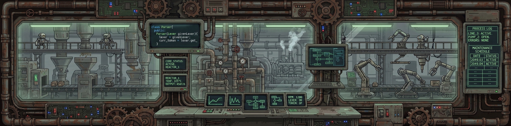
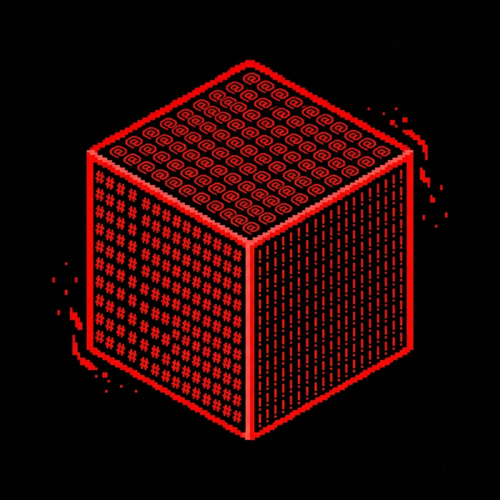

  

# Toprak Ekin Yüksel | Systems & Backend Engineer

I specialize in the "engine room" of software engineering. While many focus on the application layer, my expertise lies in building the low-level architecture that makes those applications run efficiently. 

### 🛠️ Core Engineering Focus

* **Systems Programming:** `C`, `C++`, `Memory Management`, `POSIX/Linux Internals`.
* **Compiler Design:** Lexical analysis, AST construction, and interpreter architecture (Creator of the [HOPE Language](#)).
* **Backend & API Architecture:** Building highly scalable, zero-dependency tools and infrastructure.

### 🚀 High-Impact Projects

<table>
  <tr>
    <td align="center" width="100">
      
    </td>
    <td>
      <b><a href="https://github.com/ekinyuksel12/HOPE">HOPE</a></b>  
      A lightweight, dynamic-syntax programming language interpreter built from scratch in C++17.
    </td>
  </tr>
  <tr>
    <td align="center" width="100">
      
    </td>
    <td>
      <b><a href="https://github.com/ekinyuksel12/Sapling-Log">Sapling-Log</a></b>  
      Zero-dependency, highly optimized single-header C++20 logging library leveraging template metaprogramming.
    </td>
  </tr>
  <tr>
    <td align="center" width="100">
      
    </td>
    <td>
      <b><a href="https://github.com/ekinyuksel12/Terminal-Render-Engine">Terminal-Render-Engine</a></b>  
      A 3D graphics engine running entirely within standard terminals using pure C and custom Z-Buffering—no OpenGL.
    </td>
  </tr>
  <tr>
    <td align="center" width="100">
      
    </td>
    <td>
      <b><a href="https://github.com/ekinyuksel12/TurkeyWeather">TurkeyWeather</a></b>  
      High-performance TypeScript open-source wrapper for the Turkish State Meteorological Service (MGM) API.
    </td>
  </tr>
</table>
 

  

